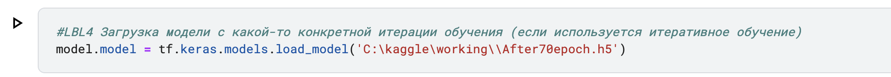

# Практическое задание №2 
## Критерии оценивания. Основная часть
Реализация модели трекинга с точностью SiBaTrAcc = **0.8604674591072365** на предоставленном тестовом наборе данных

## Критерии оценивания. Дополнения
1.Валидация модели на части обучающей выборки

3.Автоматическое сохранение модели при обучении

4.Загрузка модели с какой-то конкретной итерации обучения (если используется итеративное обучение)

5.Вывод различных показателей в процессе обучения (например, значение функции потерь на каждой эпохе)

6.Построение графиков, визуализирующих процесс обучения (график зависимости функции потерь от номера эпохи обучения, и т.п.)

7.Автоматическое тестирование на тестовом наборе/наборах данных после каждой или после некоторых эпох обучения (при использовании итеративного обучения)

13.Любое дополнительное улучшение не из списка, улучшающее результаты классификации или улучшающее опыт взаимодействия с моделью (не более 3 улучшений)
1)
2)использовать среднее значение для вычисления центра окружности

3)Если мяч не найден в одном и том же кадре, используйте последние координаты как новые координаты

